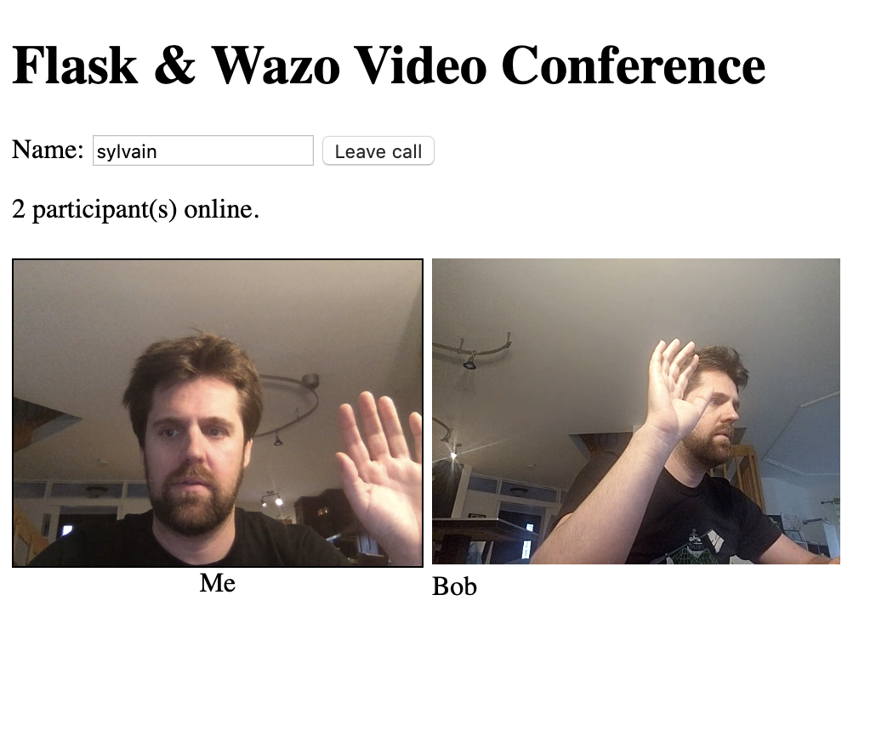

# flask-wazo-video

This is a simple web-based video conferencing application using Flask and Wazo Platform.

Thanks to Miguel Grinberg for his exemple based on Twilio. Check the source code here: https://github.com/miguelgrinberg/flask-twilio-video.

## Installation Instructions

To install the application on your system follow these steps:

1. [Install Wazo Platform](www.wazo-platform.org) It's free software!
2. Create a room and a user on the Wazo platform UI.
3. Clone this repository
4. Create a virtualenv and install the requirements
5. Create a *.env* file by copying the *.env.template* file. Fill out the values for your Wazo server, username, password and room.
6. Execute `python3 app.py` to start the server.
7. Navigate to *http://localhost:5000* on your web browser. Connecting to the service from a phone or another computer may not work, as browsers require a secure (HTTPS) connection to give access to the media APIs. In that case, I suggest you use ngrok to give your application a temporary HTTPS URL.

